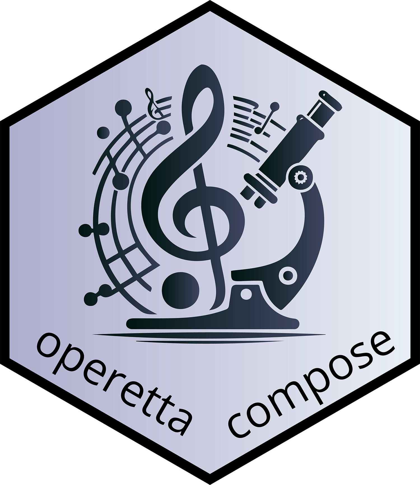

# operetta-compose 

Fractal tasks to convert and process images from Perkin-Elmer Opera/Operetta high-content microscopes. Workflows for drug response profiling built upon the OME-ZARR file standard. 

## Task library

Currently the following tasks are available:

| Task  | Description |   
|---|---|
| harmony_to_ome_zarr | Convert TIFFs which were exported from Harmony (Operetta/Opera, Perkin-Elmer) to OME-ZARR |
| stardist_segmentation | Segment cells with Stardist | 
| regionprops_measurement | Take measurements using regionprobs and write the features to the OME-ZARR | 
| label_prediction | Make predictions on the selected wells and write them to the OME-ZARR | 
| condition_registration | Register the experimental conditions in the OME-ZARR | 

## Development and installation in Fractal

1. Install the package in dev mode with `python -m pip install -e ".[dev]"`
2. Develop the function according to the [Fractal API](https://fractal-analytics-platform.github.io/version_2/)
3. Update the image list and the Fractal manifest with `python src/operio_fractal/dev/create_manifest.py`
4. Build a wheel file in the `dist` folder of the package with `python -m build`
5. Collect the tasks on a Fractal server

