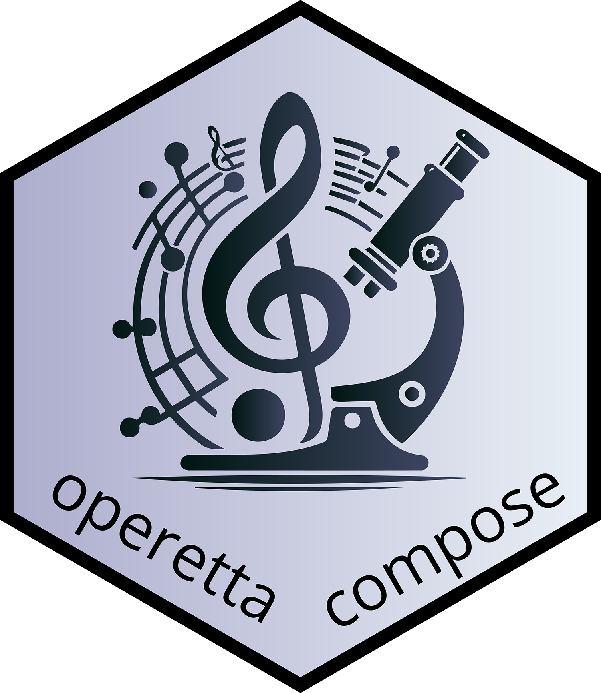

The **operetta-compose** package collects [Fractal](https://fractal-analytics-platform.github.io/fractal-tasks-core/)1 tasks to convert and process images from Perkin-Elmer Opera/Operetta high-content microscopes. It includes workflows for drug response profiling built upon the [OME-ZARR file standard](https://ngff.openmicroscopy.org/latest/).

### Available Fractal Tasks

Currently the following tasks are part of *operetta-compose*

| Task  | Description |
|---|---|
| condition_registration | Register the experimental layout as a plate-level condition table in the OME-Zarr, aligned with the [fractal-uzh-converters](https://github.com/fractal-analytics-platform/fractal-uzh-converters) Operetta converter |
| feature_classification | Classify cells with a trained scikit-learn classifier (e.g. from the [napari-feature-classifier](https://github.com/fractal-napari-plugins-collection/napari-feature-classifier)) and write back to the feature table |
| cell_count_aggregation | Aggregate cell counts per experimental condition across a plate and write results into a generic plate-level table |
| spot_detection | Detect spots with [Spotiflow](https://github.com/weigertlab/spotiflow) and count them per segmented object, writing a per-label feature table |

&nbsp;

#### Legacy tasks

The following tasks have been removed and are superseded by implementations maintained by the BioVisionCenter:

| Removed task | Replacement |
|---|---|
| harmony_to_ome_zarr   | [Operetta converter in fractal-uzh-converters ](https://github.com/fractal-analytics-platform/fractal-uzh-converters/tree/main/src/fractal_uzh_converters/operetta) |
| stardist_segmentation   | [fractal-stardist-segmentation-task](https://github.com/fractal-analytics-platform/fractal-stardist-segmentation-task) |
| regionprops_measurement   | [`measure_features` in fractal-tasks-core](https://github.com/fractal-analytics-platform/fractal-tasks-core/blob/main/fractal_tasks_core/measure_features.py) |

&nbsp;

---

1 [Fractal](https://fractal-analytics-platform.github.io/fractal-tasks-core/) is developed by the [UZH BioVisionCenter](https://www.biovisioncenter.uzh.ch/de.html) under the lead of [@jluethi](https://github.com/jluethi) under contract with [eXact lab S.r.l.](https://www.exact-lab.it).
